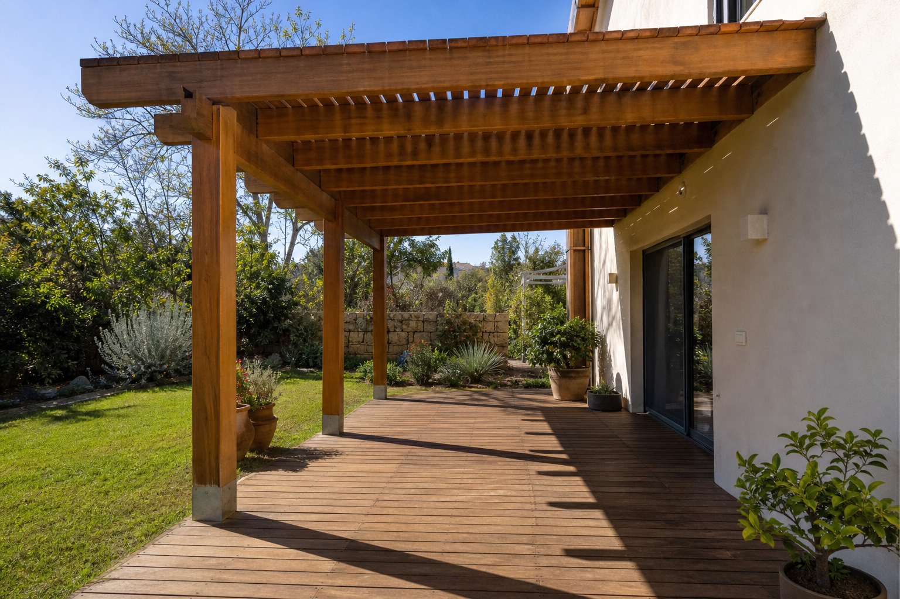

# היתר לפרגולה: מתי צריך, ולמה אישור קונסטרוקטור הוא חלק מהעבודה

ברוב המקרים לא צריך היתר לפרגולה. אבל גם כשאין צורך בהיתר, החוק דורש אישור של קונסטרוקטור ודיווח לרשות המקומית. אנשים רבים מדלגים על החלק הזה, כי הנגר שבנה להם את הפרגולה לא אמר להם שהוא קיים.

אנחנו הקונסטרוקטורים שמתכננים, מאשרים ובונים את הפרגולות שלנו. במדריך הזה נסביר מה החוק אומר בפועל, מה האישור בודק, ולמה כדאי לסגור אותו לפני שמתחילים לבנות ולא אחרי.

## צריך היתר לפרגולה? התשובה הקצרה

פרגולה שעומדת בתנאים של תקנות התכנון והבנייה (עבודות ומבנים הפטורים מהיתר), התשע"ד-2014, **פטורה מהיתר בנייה**. אין צורך להגיש בקשה לוועדה ולחכות לאישור.

אבל פטור מהיתר הוא לא פטור מכל דבר. אותה תקנה שפוטרת את הפרגולה מהיתר מחייבת גם שני דברים:

- **הודעה לרשות הרישוי** בתוך 45 ימים ממועד הביצוע.
- **אישור של מהנדס מבנים** על העיגון ועל היציבות של הפרגולה, שמצורף להודעה.

פרגולה שלא עומדת בתנאים האלה לא נהנית מהפטור.

## מה נחשב פרגולה בעיני החוק

בתקנות, פרגולה נקראת "מצללה". כדי להיחשב מצללה, המבנה צריך לעמוד בכמה תנאים:

- **בלי קירות.**
- **בנוי מחומרים קלים.**
- **התקרה היא משטח הצללה.** המרווחים בין החלקים האטומים צריכים להיות מחולקים באופן שווה, ולהוות לפחות 40% מהמשטח.

המשמעות המעשית: ברגע שסוגרים את הצדדים או מכסים את התקרה בגג אטום, זו כבר לא פרגולה במובן של התקנות, והפטור לא חל עליה. קירוי **שקוף** מותר, בתנאי שהוא צמוד לתקרת הפרגולה ולא חורג מהיקף שלה.

## תנאי הפטור: שטח, מיקום ודיווח

לפי תקנה 12, שטח הפרגולה לא יעלה על **50 מ"ר או על רבע משטח הקרקע הפנוי ממבנים או הגג, לפי הגדול מביניהם**. כלומר, בחצר גדולה או על גג גדול הפרגולה יכולה להיות גדולה מ-50 מ"ר, כל עוד היא לא עולה על רבע מהשטח הפנוי. הרבה אתרים כותבים "עד 50 מ"ר", וזה לא מדויק.

הפרגולה צריכה לעמוד **על הקרקע או על גג המבנה**.

מעבר לשטח, התקנות קובעות תנאים כלליים לכל עבודה פטורה. בין השאר, העבודה צריכה להתבצע כך שתובטח היציבות של המבנה והבטיחות של מי ששוהה בו ובסביבתו.

**הדיווח** נעשה בטופס שמוגדר בתקנות, ונמסר לרשות הרישוי המקומית בתוך 45 ימים מסיום הבנייה. אפשר להגיש אותו גם באופן מקוון, באתר מינהל התכנון. להודעה מצרפים את האישור הקונסטרוקטיבי.

## מה זה אישור קונסטרוקטור, ומה הוא בודק בפועל

לפי התקנות, האישור צריך להתייחס לשני דברים: **העיגון והיציבות של הפרגולה**, ולכך ש**כשל בפרגולה לא יתרחש בנקודת העיגון למבנה ולא יגרום לכשל במבנה** שהיא מחוברת אליו. בפרגולה שמחוברת לקיר הבית זו שאלה מעשית מאוד, כי הקיר נושא חלק מהעומס.

בפועל, כשאנחנו מאשרים פרגולה אנחנו בודקים:

- **יסודות:** על מה העמודים עומדים, ואיך הם יצוקים.
- **עיגון:** איך הפרגולה מחוברת לקיר או לגג, ולאיזה סוג קיר.
- **עומסי רוח:** פרגולה היא משטח גדול שהרוח מנסה להרים ולהזיז.
- **מפתחים:** המרחק בין העמודים, ואורך הקורות בין נקודות התמיכה.
- **חתכי הקורות:** האם העובי מספיק לאורך ולעומס שהקורה נושאת.

ויש עוד חלק, שהוא לא חישוב: לדעת את תנאי הפטור. פרגולה יכולה להיות חזקה מספיק ועדיין לא לעמוד בתנאים. למשל, אם השטח גדול מדי או אם יש פחות מ-40% מרווחים בתקרה. מי שמאשר צריך לראות את שני הצדדים.

## מי מוסמך לחתום על האישור

זו אחת הנקודות שהכי מבלבלות, גם באתרים שעוסקים בנושא. התקנות מדברות על אישור של **מהנדס מבנים**. תקנה 4ב מוסיפה שהאישור **יכול להינתן גם בידי הנדסאי מבנים**, בתנאי שהפרגולה מותקנת **על הקרקע או על גבי מבנה פשוט**.

- **הנדסאי מבנים** הוא הנדסאי שרשום במרשם ההנדסאים והטכנאים המוסמכים, במדור תכנון מבנים או בניין.
- **"מבנה פשוט"** מוגדר בתקנות המהנדסים והאדריכלים. ההגדרה כוללת מבנה בקומה אחת בגובה של עד 5 מטרים, וגם מבנה עם שלד לא טרומי, מפתחים של עד 6 מטרים ורצפת קומה עליונה בגובה של עד 11.5 מטרים מעל פני הקרקע.

כלומר, הנדסאי מבנים יכול לאשר פרגולה בחצר, וגם פרגולה על גג של בית פרטי או של בניין נמוך שעומד בהגדרה. פרגולה על גג של בניין גבוה יותר דורשת חתימה של מהנדס מבנים.

אצלנו, פרגולה היא מבנה קל שבדרך כלל נמצא בתחום שאנחנו מאשרים בעצמנו. כשפרויקט יוצא מהתחום הזה, אנחנו מביאים מהנדס מבחוץ. זה עניין שלנו, לא שלכם: אתם מקבלים פרגולה עם אישור קונסטרוקטור, בלי לחפש מי יחתום.

## נגר או בונה עם קונסטרוקטור: למה האישור צריך להגיע לפני הבנייה

הרבה אנשים פונים לנגר, מקבלים פרגולה יפה, ורק אחר כך מגלים שצריך אישור קונסטרוקטיבי. בשלב הזה נשארות שתי אפשרויות: לחפש קונסטרוקטור שיסכים לבדוק מבנה שהוא לא תכנן, או לוותר על הדיווח. אף אחת מהן לא טובה.

קונסטרוקטור שבודק פרגולה קיימת לא יודע מה יש מתחת לריצוף, איך בדיוק העמודים מעוגנים ומה מחזיק את הקורה בקיר. אם משהו לא עומד בדרישות, התיקון נעשה על מבנה גמור.

כשהחישוב נעשה לפני הבנייה, המידות, החיבורים והעיגון נקבעים מראש לפי מה שיאושר. אצלנו אלה אותם אנשים: מתכננים, מאשרים, בונים. אתם לא צריכים לרדוף אחרי אף אחד.

### הטעויות שאנחנו רואים בפרגולות שנבנו בלי קונסטרוקטור

- **קורות שמחוברות לקיר בלוקים בלי רגליים.** קיר בלוקים הוא לא קיר בטון, ומי שמחבר אליו פרגולה כאילו היה בטון, בלי רגליים שנושאות את העומס, בונה על הנחה שגויה.
- **מפתחים גדולים וקורות דקות מדי.** כשהרגליים רחוקות זו מזו והקורה הנושאת לא עבה מספיק, הפרגולה שוקעת באמצע, ולפעמים השקיעה משמעותית.
- **יציקות לא טובות של בסיסי הרגליים.** הבסיס הוא מה שמחזיק את כל המבנה בקרקע.
- **ברגים ופרזול לא תקינים.**
- **בעיות באיטום.**
- **צבעים זולים** שלא באמת מגנים על העץ.

חלק מהטעויות האלה לא נראות ביום שמסיימים לבנות. קונסטרוקטור שמתכנן לפני הבנייה מונע אותן. קונסטרוקטור שמגיע אחרי צריך לנחש מה יש בפנים.

## מתי הפטור לא חל

הפטור מהיתר חל רק על פרגולה שעומדת בכל התנאים. כמה מצבים שבהם הוא לא חל:

- **המבנה סגור או מקורה בגג אטום**, ולכן הוא לא עומד בהגדרה של מצללה.
- **השטח גדול גם מ-50 מ"ר וגם מרבע השטח הפנוי** בקרקע או בגג.
- **לא נמסרה הודעה לרשות הרישוי**, או שלא צורף לה אישור קונסטרוקטיבי.
- **הנדסאי חתם על פרגולה שלא עומדת על הקרקע או על מבנה פשוט.** במקרה כזה נדרש אישור של מהנדס מבנים.

פרגולה שלא עומדת בתנאי הפטור נחשבת בנייה שדורשת היתר.

### שני מקרים מבתי המשפט

**נהריה.** בבניין מגורים בנהריה הקימו דיירי קומת הקרקע פרגולה, ובהמשך סגרו את השטח בבלוקים. השכנים מהקומה הראשונה תבעו. בית משפט השלום בעכו קבע שמדובר בבנייה סגורה, שדורשת היתר והסכמה של כלל הדיירים. הוא הורה להרוס אותה תוך 45 ימים, ולשלם 7,500 ₪ הוצאות משפט ושכר טרחה. ([ynet](https://www.ynet.co.il/economy/article/s100irhkb2))

**תל אביב.** זוג בנה פרגולה במרפסת של דירה בקומה השביעית, והגיש הודעה על בנייה פטורה מהיתר, כנדרש. הוועדה המקומית הוציאה בכל זאת צו הריסה. בית המשפט לעניינים מקומיים ביטל את הצו, כי הוא לא הסביר מהי ההפרה, וחייב את הוועדה ב-10,000 ₪ הוצאות. עם זאת, הרשות רשאית להוציא צו חדש ומנומק. ([Bizportal, אוגוסט 2026](https://www.bizportal.co.il/takdin/news/article/20039713))

בשני המקרים השאלה הייתה אם המבנה עומד בתנאי החוק. את זה בודקים לפני שבונים.

## שאלות נפוצות

### צריך היתר לבניית פרגולה?
לא, אם הפרגולה עומדת בתנאי הפטור: בלי קירות, מחומרים קלים, עם לפחות 40% מרווחים בתקרה, ובשטח שלא עולה על 50 מ"ר או על רבע מהשטח הפנוי בקרקע או בגג (הגדול מביניהם). גם אז, חובה לדווח לרשות הרישוי ולצרף אישור קונסטרוקטיבי.

### תוך כמה זמן צריך לדווח לעירייה על פרגולה?
בתוך 45 ימים ממועד הביצוע. ההודעה נמסרת לרשות הרישוי המקומית, ואפשר להגיש אותה גם באופן מקוון באתר מינהל התכנון.

### מי יכול לחתום על אישור קונסטרוקטור לפרגולה?
מהנדס מבנים. הנדסאי מבנים רשום יכול לחתום כשהפרגולה מותקנת על הקרקע, או על גג של "מבנה פשוט" כהגדרתו בתקנות. זה כולל בית פרטי ובניינים נמוכים.

### אפשר לקבל אישור קונסטרוקטור לפרגולה שכבר נבנתה?
כן, בתהליך של כמה שלבים. הקונסטרוקטור בודק את הפרגולה, מכין תוכנית, ואם צריך, מבצעים תיקונים ובודקים אותם שוב. חשוב לדעת מראש שהקונסטרוקטור עשוי לפסול את המבנה. זה מבאס, אבל זה מציל חיים.

### איפה אפשר לקרוא את החוק עצמו?
הנוסח המלא של [תקנות התכנון והבנייה (עבודות ומבנים הפטורים מהיתר)](https://www.nevo.co.il/law_html/law01/501_065.htm) זמין באתר נבו. ההוראות על פרגולה נמצאות בתקנה 12.

---

רוצים פרגולה שהתכנון, אישור הקונסטרוקטור והבנייה שלה אצל אותם אנשים? אפשר לראות [איך אנחנו עובדים, שלב אחרי שלב](https://baimbetov.me/#process).
